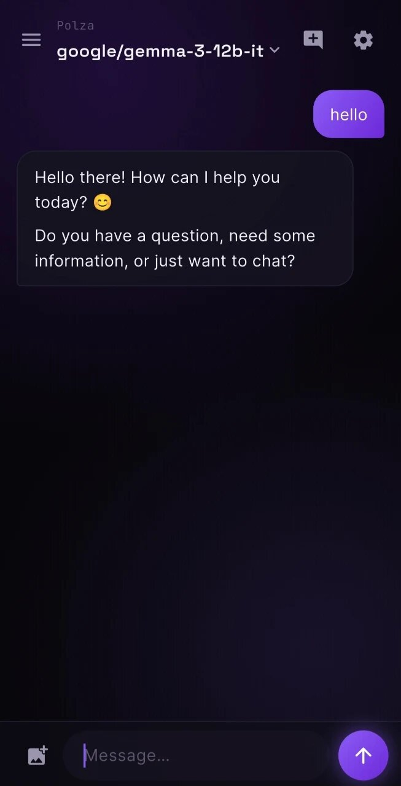

# Arcade AI

> Universal multi-provider LLM chat client for Android — dark, fluid, secure.

🇷🇺 [Версия на русском](README.ru.md)

Arcade AI is a single mobile app that talks to **any** large language model. Drop
in an API key, pick a provider, choose a model — and chat. From global giants
(OpenAI, Anthropic, Google) to Russian platforms (YandexGPT, GigaChat) to your
own endpoint (Polza AI, a proxy, or a local Ollama server).

<p align="center"><i>Black canvas · violet aurora · buttery animations</i></p>

<p align="center">
  
</p>

---

## Features

- **14 built-in providers** + a fully custom one (any OpenAI- or Anthropic-compatible endpoint).
- **Streaming responses** — text appears token by token, like the web chats.
- **Reasoning view** — for thinking models (o-series, DeepSeek R1, Claude with
  extended thinking) a collapsible panel shows *how* the model reasoned before answering.
- **Vision** — attach photos to your message where the model supports it.
- **Bilingual UI** — English / Russian, picked on the welcome screen, switchable later.
- **Security first** — API keys live in the hardware-backed **Android Keystore**
  (AES-GCM); optional **biometric auto-lock** on reopen.
- **Crafted design** — pure-black surfaces, restrained violet accents, an animated
  aurora background, and motion on every meaningful transition.

## Supported providers

| Global | Russian / Regional | Local & custom |
|---|---|---|
| OpenAI, Anthropic, Google Gemini, Groq, DeepSeek, xAI Grok, Mistral, Together AI, OpenRouter, Cohere, IBM Granite | YandexGPT (Alice), GigaChat (Sber) | Ollama, any custom endpoint |

> Providers requiring a special OAuth/IAM token exchange (YandexGPT, GigaChat,
> watsonx) are wired with the correct request shape and flagged in the UI for
> manual setup.

> **Local models (Ollama)** connect to a *running Ollama server* over HTTP
> (`localhost:11434`) — the app does **not** load `.gguf` files directly. True
> on-device GGUF inference (pick a file, run it on the phone via llama.cpp) is on
> the roadmap, not in this build.

## Why these languages?

This started as a "mix the languages to look cool" idea. The honest engineering
answer shaped the final stack:

- **Dart + Flutter — the whole app.** Flutter is Dart's killer capability: one
  codebase compiled to native ARM, a self-rendered UI (Skia/Impeller) that looks
  pixel-identical on every device, and sub-second hot reload. For a polished,
  heavily-animated single-screen-flow app, nothing else gets you there faster.

- **No Rust (yet) — and that's the secure choice.** The instinct was to add Rust
  for "security via custom encryption." But hand-rolled crypto is a liability;
  the **Android Keystore** stores keys in a hardware security module where the
  secret never leaves the chip — strictly stronger than app-level AES. The app is
  network-bound (it waits on API calls), so there is no CPU hotspot for Rust to
  accelerate. Rust earns its place the day we add **on-device local inference** —
  that's a real compute task, and it's the planned hook for it.

The principle: every language must pull its weight, not pad a buzzword list.

## Architecture

```
lib/
├── core/        theme, global app state (ChangeNotifier)
├── models/      provider, chat message, generation config
├── data/        provider catalog · Keystore key store · settings
├── services/    streaming LLM client (OpenAI + Anthropic shaping)
├── ui/
│   ├── onboarding/   language → provider grid → connect form
│   ├── chat/         chat screen · model switcher
│   ├── settings/     settings · biometric lock screen
│   └── widgets/      ambient background · bubbles · reasoning block
└── l10n/        EN / RU strings
```

## Build

```bash
flutter pub get
flutter build apk --release
# output: build/app/outputs/flutter-apk/app-release.apk
```

Requires Flutter (stable) and the Android SDK. Minimum Android 6.0 (API 23).

## Security model

| Concern | Approach |
|---|---|
| API keys at rest | Android Keystore via `flutter_secure_storage` (AES-GCM, hardware-backed) |
| App reopen | Optional biometric / device-credential lock (`local_auth`) |
| Network | HTTPS to providers; cleartext allowed only for `localhost` (Ollama) |
| Telemetry | None — the app talks only to the provider you configure |

## License

MIT — see [LICENSE](LICENSE).

---

<p align="center">
  Built by <a href="https://github.com/NickIBrody">github.com/NickIBrody</a>
</p>
